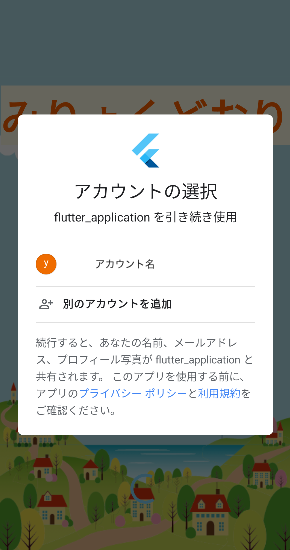
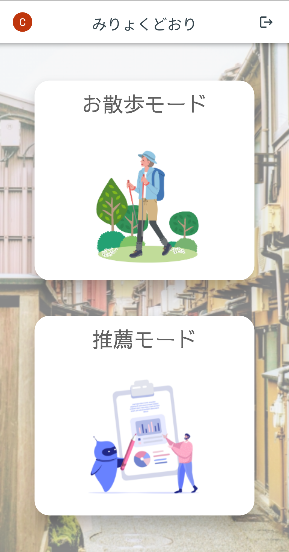
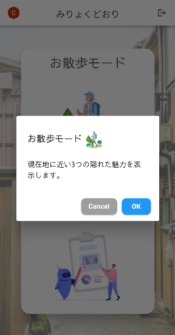
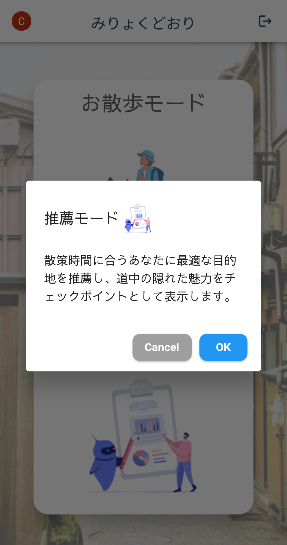
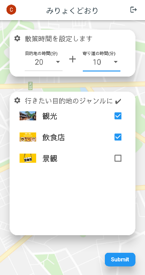
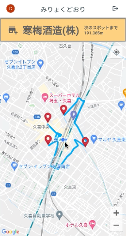
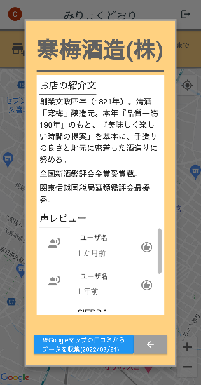

[](https://youtu.be/YPfbGVHeucs)

``画像をクリックするとアプリの説明(youtube)を聞くことができます``

# **みりょくどおり**アプリケーション

## 概要

このアプリはクロスプラットフォーム開発フレームワークとして「**Flutter**」を用いて開発しています。

1. **1.バックグラウンドでのGPS情報の取得**と**2.Android OS,iOSを問わずに提供する**ことを目的としたアプリケーション
2. チーム開発における短期間での実装の容易さ

上記1,2点を考慮してプログラム言語及びフレームワークの選定を行いました。

バックグラウンドでのGPS情報の取得にはFlutterが提供する[location](https://pub.dev/packages/location)を用いており、チーム開発における短期間での実装のためにプロトタイプの作成及びUIに関しては、[AdobeXD](https://www.adobe.com/jp/products/xd.html)を使って実装しています。Adobe XDは、ワイヤーフレーム、アニメーション、プロトタイプ、共同作業などの機能がすべて統合されたウェブデザインツールであり、[Adobe XD to Flutter plugin](https://medium.com/flutter-community/adobe-xd-to-flutter-plugin-6eede357d21c)を使うことで、アプリケーション内のUIの実装をより容易に実現することができました。

### アプリについて

アプリ説明動画([youtube](https://youtu.be/KuQwmeWf6hQ))に限定公開しています。デモアプリはAndroid向けに実装しており、Google Pixel3a(エミュレータ)とAQUOS zero2(実機)で動作確認済です。開発はMacBookProで行っています。

```text
・macOS Big Sur バージョン11.6（MacBook Pro）, メモリ 16 GB 3733 MHz LPDDR4X, 2 GHz クアッドコアIntel Core i5
・Android Studio Bumblebee | 2021.1.1 Patch 2
・Vscode バージョン: 1.65.2
・Flutter 2.10.3
```

### チーム「チキン」のプログラム経験

Pythonの使用歴が約4年のメンバが1人、他のメンバはPythonを1年程度使用しています。全員がプログラムの利用目的はAIモデルの実装などデータ分析が中心でありモバイルアプリケーションの開発経験はなく、Flutterは全員が初めて触れる経験となります。

## ディレクトリ構成

✔︎：みりょくどおりを実装する上で記述したソースコードなど
※：本ドキュメントでは述べない範囲(アプリをAndroid向けに実装する上で必要な設定を記入した箇所や参考サイトの割合が多い部分など)

```md
flutter_application/
 ├ android
    ├ build.gradle ※
    ├ app/src/build.gradle ※
    ├ app/src/main/AndroidManifest.xml ※
 ├ assets ✔︎ # アイコン画像
 ├ images ✔︎ # 背景画像
 ├ ios
 ├ lib ✔︎
    ├ provider # providerを用いたリアルタイムトラッキング
        ├ location_provider.dart ※
    ├ res # カラー情報やテキスト情報の変数一覧
        ├ custom_colors.dart ✔︎
        ├ custom_text.dart ✔︎
    ├ screens # アプリで表示される画面
        ├ recommend_map.dart ✔︎
        ├ recommend_setting.dart ✔︎
        ├ sign_in_screen.dart ✔︎
        ├ stroll_map.dart ✔︎
        ├ user_info_screen.dart ✔︎
    ├ utils # Googleアカウントによる認証
        ├ authentication.dart ※
    ├ widgets # アプリで表示される画面で使用したUIを構築しているパーツ
        ├ google_sign_in_button.dart ✔︎
        ├ header.dart ✔︎
        ├ introduction.dart ✔︎
        ├ kind_checkboxlist.dart ✔︎
        ├ loading_widght.dart ✔︎
        ├ mode_button.dart ✔︎
        ├ mode_dialog.dart ✔︎
        ├ submit_api_button.dart ✔︎
        ├ time_textfield.dart ✔︎
    ├ main.dart ✔︎ # 実行プログラム
 ├ test
 ├ web
 ├ windows
 ├ .gitignore ※
 ├ .metadata
 ├ analysis_options.yaml
 ├ pubsepc.lock
 ├ pubsepc.yaml ※
```

### 画面別の実装内容の説明

#### タイトル及び認証画面

 

Firebaseが提供しているAuthenticationと連携してGoogleアカウントを利用した認証画面を作成しました。複数のアカウントを作成するのはユーザにとって不便であるためアカウント作成を行わずに既存のアカウントを利用したログインを採用しました。

<該当するプログラム>

```text
sign_in_screen.dart # 画面を構成するファイル
authentication.dart # 認証機能
google_sign_in_button.dart # サインインを行う際のボタンを実装
```

#### モード選択

   

「お散歩モード」と「推薦モード」を選ぶことができる画面を作成しました。デモアプリでは「推薦モード」の実装を行っています。お散歩モードと推薦モードのどちらかのボタンをタッチすると、モードの説明画面とキャンセルボタンとOKボタンが表示されます。OKボタンをタッチするとそれぞれに該当する画面に遷移します。ヘッダーの左上はGoogleアカウントのアイコン画像、中央はアプリ名、右上はログアウトボタンになっており他の画面でも共通して実装しています。

<該当するプログラム>

```text
user_info_screen.dart # 「お散歩モード」と「推薦モード」を選ぶことができる画面
mode_button.dart # ボタンを構成するパーツの実装
mode_dialog.dart # ボタンを押した時のShowDialogと画面遷移を実装
header.dart # ヘッダー
stroll_map.dart # お散歩モードを選んだ際の遷移先(GoogleMap上に現在地を表示してトラッキングを行う)
```

#### 推薦モード

 

目的地の時間と寄り道の時間を0~60分までの間で入力し、行きたい目的地のジャンルをチェックすることができます。入力が完了した時に、Submitボタンをタッチすることで、別途実装した[RecommendAPI](../flaskAPI/../README.md)を要求し応答を完了したら画面遷移します。いつもとは違う道を歩きたいユーザが使うことで新たな魅力を発見できます。

<該当するプログラム>

```text
recommend_setting.dart # 入力画面
kind_checkboxlist.dart # ジャンル別のチェックボックスリストを実装
submit_api_button.dart # 入力した情報をAPIに送り結果を受け取るまでローディングし、その後に遷移する
time_textfield.dart # 目的地の時間と寄り道にかかる時間を入力する
```

#### 推薦モードのマップ画面

 

別途実装した[RecommendAPI](../flaskAPI/../README.md)によって決まった目的地を[赤いピン](./assets/pin.png)、[道中の隠れた魅力スポット](./assets/spots_pin.png)でGoogleMAP上に表示します。現在地から最も近いスポットを上部のオレンジ枠に表示しています。また、現在地からスポットまでの距離をリアルタイムで表示します。上部のオレンジ枠はボタンになっており、タッチすることで表示されているスポットの情報を閲覧することができます。デモでは観光・飲食店・景観に該当する久喜市の約80スポットが登録されています。

<該当するプログラム>

```text
google_maps_flutter.dart' # 推薦モードのマップ画面を実装
```

#### スポットの情報

 

画面ではなく、ポップアップで表示されるものになっており、最も近いスポットの情報を閲覧することができます。また、お店の紹介文には**自治体だからもつ紹介文**と**声レビュー**が載っています。デモでは[埼玉県が提供するオープンデータ](https://opendata.pref.saitama.lg.jp/)を元にデータベースを構築しており、紹介文は実際に自治体が提供している紹介文になっています。[RecommendAPIのREADME.md](../flaskAPI/../README.md)にデータベースの詳細を記載しています。声レビューは、Google Cloud  Platform が提供しているPlace APIで取得したスポットのクチコミをFlutterのパッケージ[flutter_tts](https://pub.dev/packages/flutter_tts)で音声合成しており、タッチすることで音声が流れます。

<該当するプログラム>

```text
introduction.dart # スポットの情報を表示
```

## pub.dev

使用したパッケージの一覧

```:yaml
google_fonts: ^2.3.1 # 中国風フォントを解消するためのプラグイン
google_maps_flutter: ^2.1.2 # Google Maps widget プラグイン
provider: ^6.0.2 # AttachedWidgetのラッパー
location: ^4.3.0 # 位置情報を取得するプラグイン
adobe_xd: ^2.0.1 # Adobe XD -> Flutter のプラグイン
firebase_core: ^1.13.1 # Firebaseの初期化
firebase_auth: ^3.3.11 # Firebaseの認証
google_sign_in: ^5.2.4 # Googleサインインを利用
shared_preferences: ^2.0.13 # 状態管理
cloud_firestore: ^3.1.10 # firebase storeを利用
http: ^0.13.4 # http通信
geolocator: ^8.2.0 # 距離計算
flutter_tts: ^3.3.3 # TTS
```

## 実装する上で参考にしたサイト

- [スマホ機能編2:位置情報(GeoLocation)](https://zenn.dev/kazutxt/books/flutter_practice_introduction/viewer/smartphone_geolocation)
- [Flutter Google Maps and Live Location Tracking](https://aayushbajaj505.medium.com/flutter-google-maps-and-live-location-tracking-83bb8224032c)
- [Flutter Tutorial - Google Map with Live Location Tracking](https://github.com/techwithsam/google-map-flutter)
- [Flutterを使ったGoogleサインイン＆Firebase認証](https://blog.codemagic.io/firebase-authentication-google-sign-in-using-flutter-jpn/)
- [Flutter で Google Map に現在位置を表示する](https://qiita.com/kurararara/items/78709987460024b72b04)
- [【Flutter】 全画面覆うようにローディングを表示する](https://qiita.com/bon_ninax/items/331eabfdd2cab9efca96)